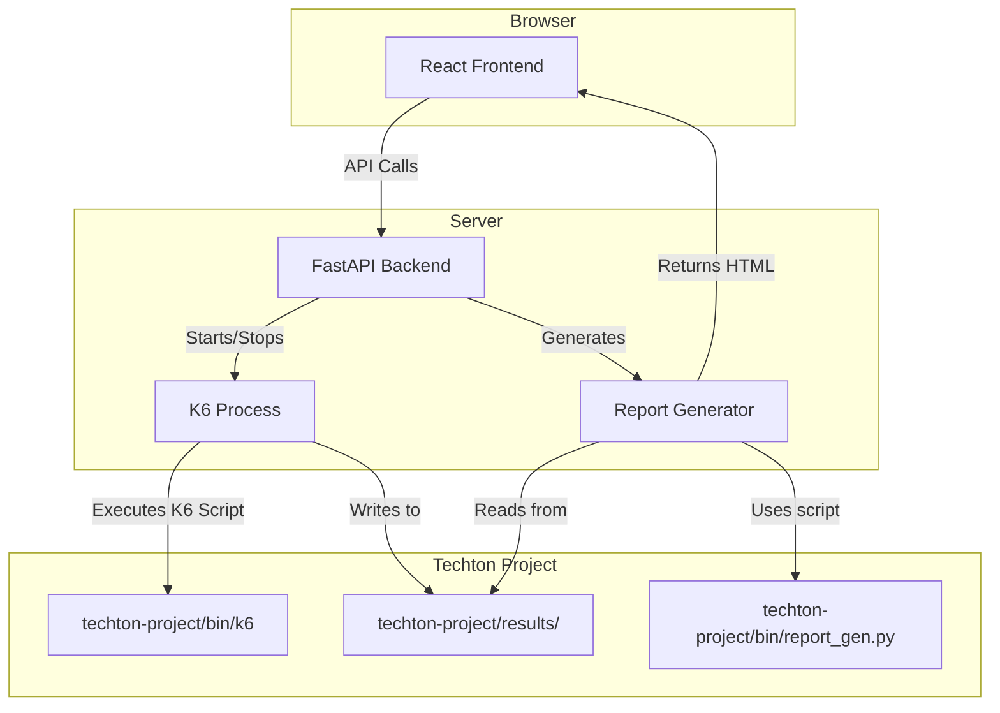

# Techton Web ⚡

> A web-based dashboard for the Techton Active Directory Stress Testing Suite.


Techton Web provides a user-friendly graphical interface for running and monitoring stress tests with Techton. It also provides a way to view historical reports.

---

## 🛠️ Tools & Technology Stack

-   **Backend:**
    -   [**FastAPI**](https://fastapi.tiangolo.com/): A modern, fast (high-performance), web framework for building APIs with Python 3.7+ based on standard Python type hints.
    -   [**Uvicorn**](https://www.uvicorn.org/): A lightning-fast ASGI server, for running FastAPI.
-   **Frontend:**
    -   [**React**](https://reactjs.org/): A JavaScript library for building user interfaces.
    -   [**Tailwind CSS**](https://tailwindcss.com/): A utility-first CSS framework for rapid UI development.
-   **Core Engine:**
    -   [**K6**](https://k6.io/): A modern load testing tool, written in Go.
    -   [**Python Subprocess**](https://docs.python.org/3/library/subprocess.html): Used to orchestrate K6 test runs.

---

## 🏗️ Architecture

The Techton Web dashboard is composed of three main components:

1.  **Frontend**: A single-page React application that provides the user interface.
2.  **Backend**: A FastAPI server that handles test configuration, execution, and reporting.
3.  **Techton Core**: The underlying `techton-project` which contains the K6 binaries and reporting scripts.



---

## 🌊 Methodology

The web application follows a simple but effective methodology for stress testing:

1.  **Configuration**: The user configures the test parameters (target, VUs, duration, etc.) through the React frontend.
2.  **Execution**: The FastAPI backend receives the configuration and prepares a K6 JavaScript test file on the fly. It then executes the K6 binary as a subprocess.
3.  **Monitoring**: The frontend polls the backend's `/api/status` endpoint to get real-time updates on the test's progress.
4.  **Reporting**:
    -   **Live Report**: Once a test is finished, an "Executive Summary" is generated by the backend based on the test's exit condition (e.g., premature stop).
    -   **Historical Report**: The frontend can request a list of historical runs from the `/api/reports/history` endpoint. When a user wants to view a specific report, the backend calls the `report_gen.py` script from the `techton-project` to generate a detailed HTML report from the raw test data.

---

## 📜 Flowchart & Usage

1.  **Start the Server**:
    ```bash
    cd techton-web
    ./start.sh
    ```
2.  **Open the Dashboard**: Navigate to `http://localhost:8000` in your web browser.
3.  **Configure Test**:
    -   Enter the IP address of the target Active Directory server.
    -   Select the attack mode (Stress Test or Security Audit).
    -   Define the number of Virtual Users (VUs) and the test duration.
    -   Choose the authentication method (single user or a CSV file for multiple users).
4.  **Initiate Test**: Click the "INITIATE STRESS TEST" button.
5.  **Monitor Live**: Observe the live telemetry panel for active threads and elapsed time. The system log will provide real-time updates.
6.  **View Report**:
    -   Once the test is complete, an executive report card will appear.
    -   Scroll down to the "Historical Reports" table to view a list of all past runs.
    -   Click "View Report" on any run to open a detailed, interactive HTML report in a modal window.

---

## ✨ Features

-   **Intuitive Web Interface:** Easily configure and launch stress tests without complex command-line arguments.
-   **Real-time Monitoring:** Live updates on test status, duration, and active users.
-   **Dual Attack Modes:**
    -   **Stress Test:** Generate high-volume load on the server.
    -   **Security Audit:** Check for common misconfigurations and vulnerabilities.
-   **Flexible Authentication:**
    -   Test with a single user's credentials.
    -   Simulate a multi-user scenario by uploading a CSV file of usernames and passwords.
-   **Instant Executive Summaries:** Get an immediate, high-level overview of test performance with a letter grade score.
-   **In-depth Historical Analysis:**
    -   Browse a persistent history of all test runs.
    -   Generate and view detailed, interactive HTML reports with charts for latency, throughput, and errors.

---

## 📄 License

This project is distributed under the MIT License. See `LICENSE` in the main project directory for more information.

